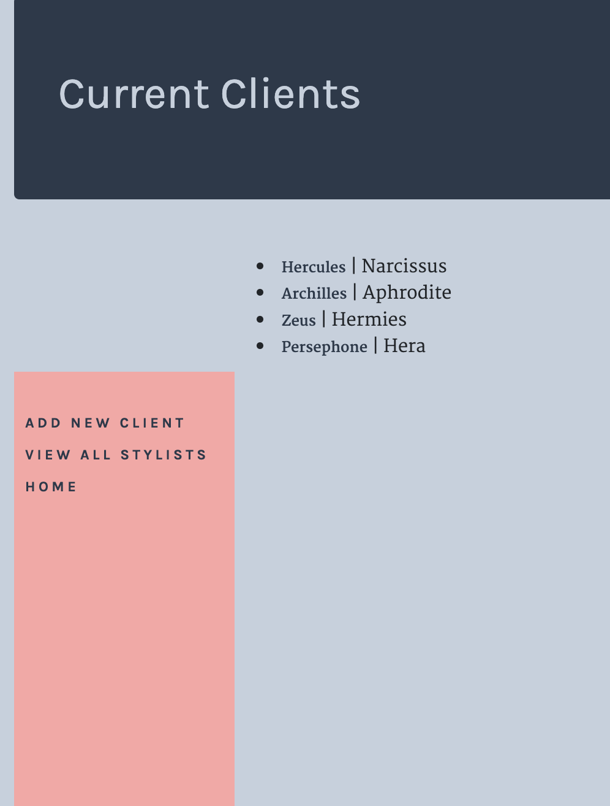

# _Hair Salon_

#### By _Liam Campbell_


#### _A client book for the stylists of Eau Claire's salon_



## Table of Contents

**[Technologies Used](#technologies-used)  
[Description](#description)  
[Setup/Installation Requirements](#setup-and-installation-requirements)  
[Known Bugs](#known-bugs)  
[License](#license)**

## Technologies Used

* _C#_
* _.NET_
* _HTML_
* _CSS_
* _SQL Workbench_
* _Entity Framework_
* _MVC_

---
## Description

_This is an MVC application that was built using C#. The purpose of this application is to allow the user to keep track of the current stylists and their clients for a salon.. When the application runs, the user can add a stylist. After the type is inputted using the "add" button, users can then add clients to that specific stylist. The client details support a name and description. Once the client is added, it will appear under that specific stylist list._

_Check out this app by clicking [here](http://lcmpbll.github.io/Hair-Salon.Solution)_

---
## Setup and Installation Requirements

<details>
<summary><strong>Initial Setup</strong></summary>
<ol>
<li>Copy the git repository url: https://github.com/lcmpbll/Hair-Salon.Solution
<li>Open a shell program and navigate to your desktop.
<li>Clone the repository for this project using the "git clone" command and including the copied URL.
<li>While still in the shell program, navigate to the root directory of the newly created file named "HairSalon.Solution".
<li>From the root directory, navigate to the "HairSalon" directory.
<li>Move onto "SQL Workbench" instructions below to re-create database necessary to run this project.
<br>
</details>

<details>
<summary><strong>SQL Workbench Configuration</strong></summary>
<ol>
<li>Create an appsetting.json file in the "HairSalon" directory of the project*  
   <pre>Hair-Salon.Solution
   └── HairSalon
    └── appsetting.json</pre>
<li> Insert the following code** : <br>

<pre>{
  "ConnectionStrings": {
    "DefaultConnection": "Server=localhost;Port=3306;database=hair_salon;uid=root;pwd=[YOUR-PASSWORD-HERE];"
  }
}</pre>
<small>*note: you must include your password in the code block section labeled "YOUR-PASSWORD-HERE".</small>
<small>**note: if you plan to push this cloned project to a public-facing repository, remember to add the appsettings.json file to your .gitignore before doing so.</small>

<li>Once "appsettings.json" file has been created, navigate back to SQL Workbench.
<li>Import the database named "hair_salon.sql" from the root directory of the project.<br><br>
How to Import a Database:
<ol> 
  <li>Open SQL Workbench.
  <li>Navigate to "Administration" tab in SQL Workbench.
  <li>Click "Data Import/Restore".
  <li>Select the radio button "Import from Self-Contained File" and include file path to the sql file of this project you cloned to your machine.
  <li>In "Default Schema to be Imported to" click "New".
  <li>Name the schema "hair_salon" then click "OK".
  <li>Once named, switch to "Import Progress" tab and click "Start Import".
  
</details>

<details>
<summary><strong>To Run</strong></summary>
Navigate to:  
   <pre>HairSalon.Solution
   └── <strong>HairSalon</strong></pre>

Run ```$ dotnet restore``` in the console.<br>
Run ```$ dotnet run``` in the console
</details>
<br>

This program was built using *`Microsoft .NET SDK 5.0.401`*, and may not be compatible with other versions. Your milage may vary.

## Known Bugs

* Any known bugs

## License

_Feel free to reach out via [Github](github.com.lcmpbll) to provide feedback on this project or to view my other projects._

[Copyright](LICENSE) (c) _07-29-2022_ _Liam Campbell_
